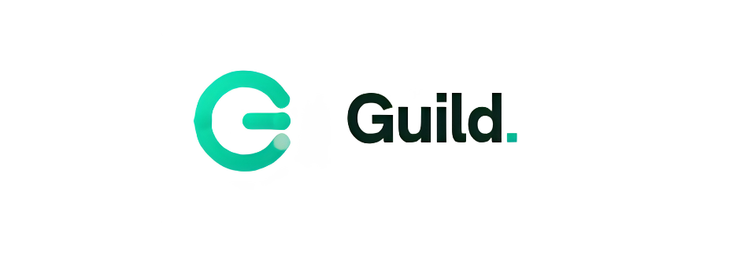

# Guild 



**A camada de cooperação descentralizada e poder de mercado para sellers de e-commerce construída na Solana.**

---

## 🔗 Solana Devnet Deployments

Fatos e endereços do deploy do programa em ambiente de testes da Solana Devnet:

*   **Program ID do Contrato**: [`FPezMd8XbqDEYXsDgqRW7bpGQ6HDdnjnzMbKpNMjcPkL`](https://explorer.solana.com/address/FPezMd8XbqDEYXsDgqRW7bpGQ6HDdnjnzMbKpNMjcPkL?cluster=devnet)
*   **Token de Governança (Mint)**: [`DPd4G6RYKrmYKnYTjRRhpJhR45JJjs1mXnkoXibbd5Sg`](https://explorer.solana.com/address/DPd4G6RYKrmYKnYTjRRhpJhR45JJjs1mXnkoXibbd5Sg?cluster=devnet)

---

## 💡 O Problema

Sellers de marketplaces brasileiros (como Mercado Livre, Shopee, Amazon e Magalu) operam em um cenário de isolamento comercial severo. Embora os marketplaces facilitem a venda, os lojistas perdem competitividade nos espaços onde as plataformas não interferem:

*   **Estoque**: Comprando sozinhos e em pequena escala, pagam o preço mais caro do atacado e perdem margem de lucro.
*   **Mídia & Tráfego**: Disputam o leilão de anúncios (CPM) de forma fragmentada contra concorrentes corporativos com orçamentos centenas de vezes maiores.
*   **Creators & Live Commerce**: Não conseguem custear campanhas conjuntas de *live shopping* de forma justa e transparente sem riscos de calote.
*   **Logística & Frete**: Não possuem escala para negociar tarifas flat de transportadoras regionais.

---

## 🚀 A Solução — Guild

A **Guild** é uma plataforma que transforma o cooperativismo tradicional em um protocolo digital descentralizado e trustless na rede Solana. Ao unificar lojistas sob uma DAO autônoma, a plataforma permite a formação de consórcios ágeis para a compra coletiva de estoque, contratação de creators em bloco e aquisição de mídia em escala.

```
Seller entra → deposita stake inicial → recebe governance tokens (PODER DE VOTO)
     ↓
1% a 5% de cada venda → treasury compartilhado (custodiado por uma PDA segura)
     ↓
Membro propõe pauta (estoque coletivo, frete unificado, creator pools)
     ↓
Votação direta (72h) → Aprovado → Smart Contract libera o capital on-chain para o Pix do fornecedor
```

**Sem intermediários humanos. Tudo transparente, seguro e 100% auditável on-chain.**

---

## 📖 Documentação do Projeto

Para uma compreensão aprofundada das diretrizes estratégicas, modelagem de negócios, personas, arquitetura técnica e análise financeira da Guild, acesse o nosso documento oficial de especificação e modelagem executiva:

👉 **[Acesse a Documentação Oficial da Guild](./documents/documentation.md)**

A documentação detalha a viabilidade da DAO, mitigação de riscos de governança para sellers de marketplace e a fundamentação da infraestrutura on-chain do projeto.

## 📁 Estrutura do Repositório

A organização do código reflete a separação de responsabilidades entre governança on-chain, interfaces interativas e documentação executiva estratégica:

*   **[`/app`](./app)**: **Frontend da Aplicação (Next.js, TypeScript & Tailwind CSS)**
    O painel web interativo da Guild. Possibilita a conexão nativa com a Phantom Wallet, controle por slider dinâmico da margem de contribuição (1% a 5%) com cálculo de peso de voto em tempo real, visualização de gráficos do treasury global e um painel de governança completo para votações e criação de novas propostas.
*   **[`/programs`](./programs)**: **Smart Contracts / Programas On-chain (Solana & Anchor/Rust)**
    O núcleo de segurança da Guild. Contém a lógica imutável das regras de governança, incluindo controle de PDAs (Program Derived Addresses) para o treasury coletivo, restrições de voto único anti-Sybil, custódia e execução trustless de capital atrelada ao quórum de votação.
*   **[`/tests`](./tests)**: **Suíte de Testes Automatizados (Mocha & TypeScript)**
    Garante a integridade do código on-chain, executando testes de stress sobre as instruções de entrada de membros, criação de propostas, cômputo de pesos de voto e execução financeira.
*   **[`/documents`](./documents)**: **Fundamentação Executiva & Planejamento Estratégico**
    Seção contendo toda a modelagem de negócios, análise competitiva (SWOT, 5 Forças de Porter, Canvas) e viabilidade do projeto. Para mais detalhes e informações profundas da tese executiva, consulte o material completo na pasta [`/documents`](./documents).

---

## 🛡️ Impacto & Diferenciais Técnicos

*   **Zero Confiança em Terceiros**: A custódia do capital coletivo em USDC é 100% controlada por uma Program Derived Address (PDA). O dinheiro só se move com aprovação majoritária por voto on-chain, anulando o risco de desvio ou má gestão do caixa compartilhado.
*   **Interface Inclusiva (Premium Off-White)**: UX baseada em simplicidade, desenvolvida para lojistas tradicionais utilizarem carteiras e termos cripto de maneira intuitiva e transparente.
*   **Integração Web3 Real**: Conexão fluida de carteiras e assinaturas rápidas na rede de alta velocidade e baixo custo da Solana, ideal para micropagamentos recorrentes e liquidação ágil.

---

## ⚖️ Licença

Distribuído sob a licença MIT. Veja `LICENSE` para mais informações.