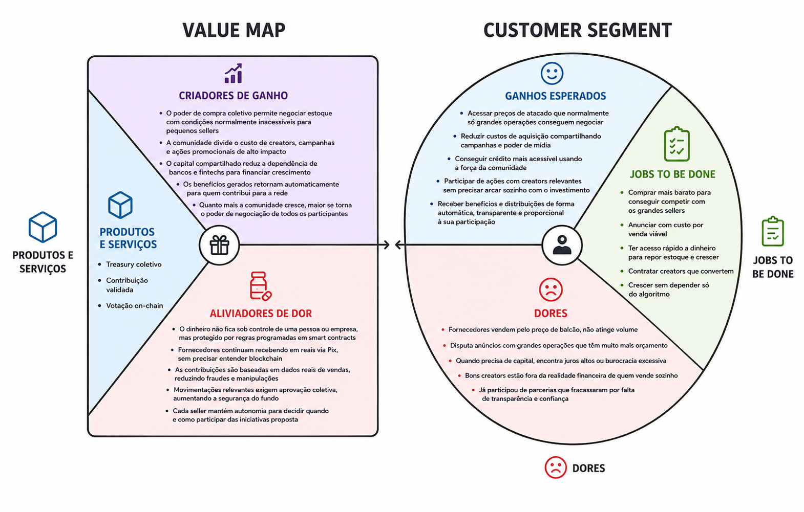
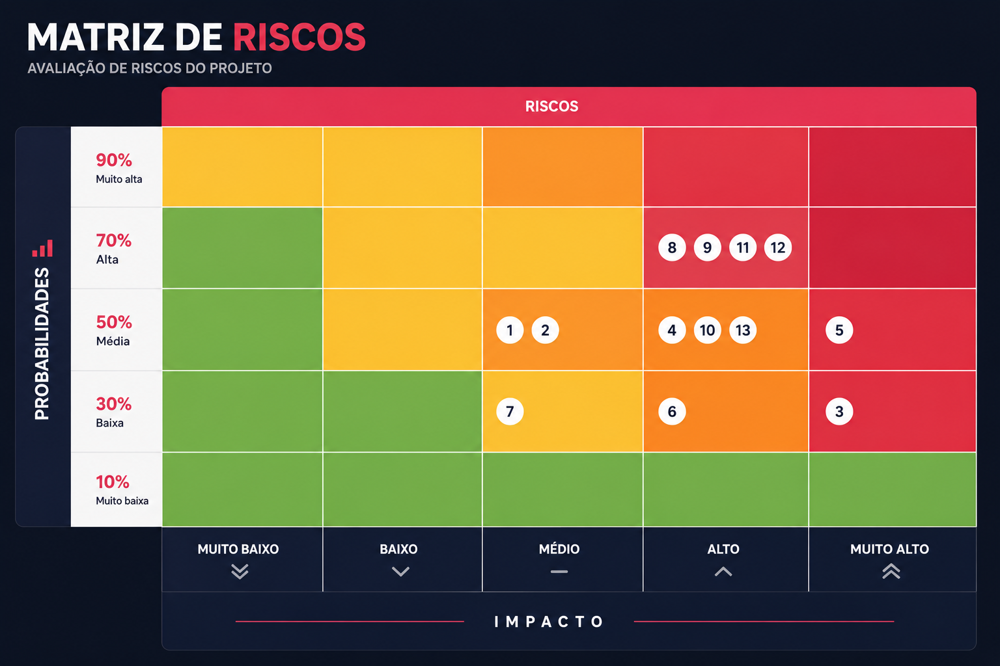
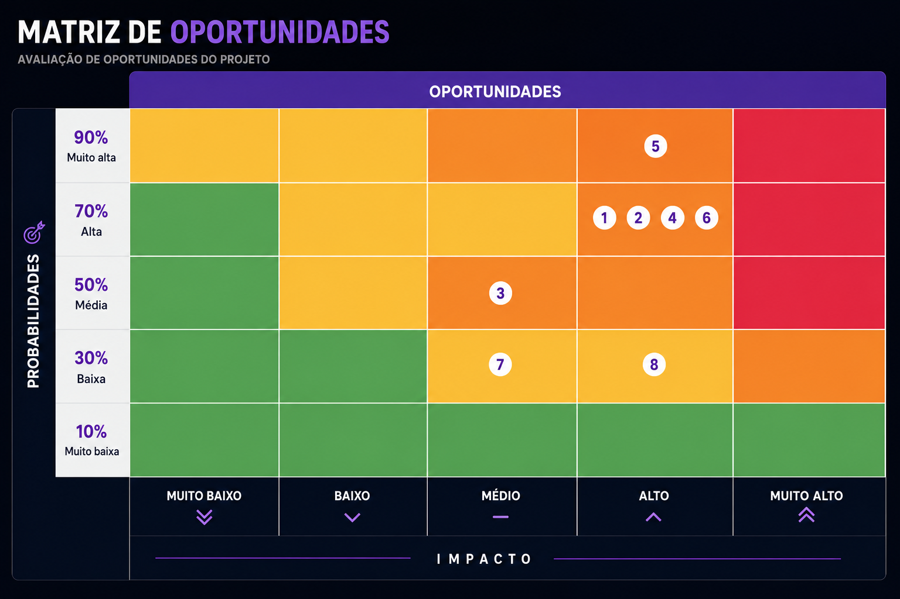
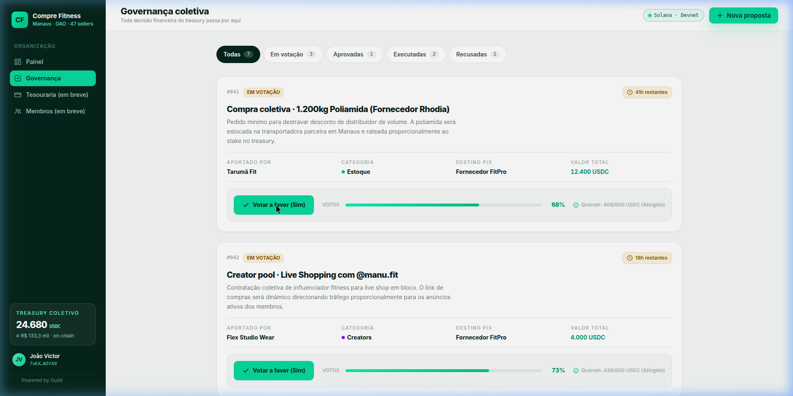
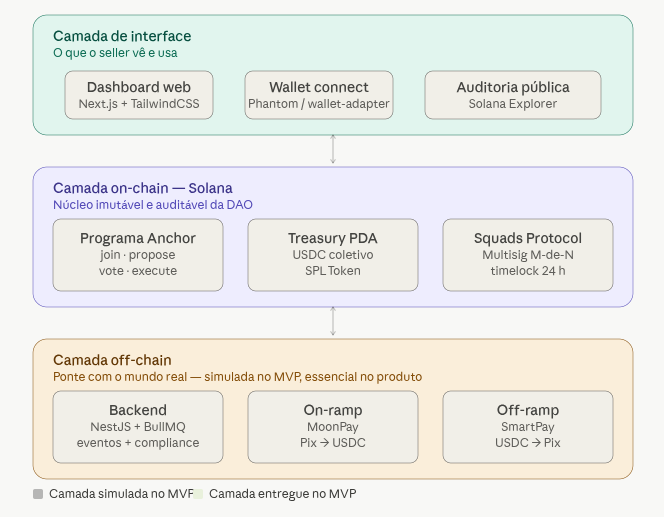
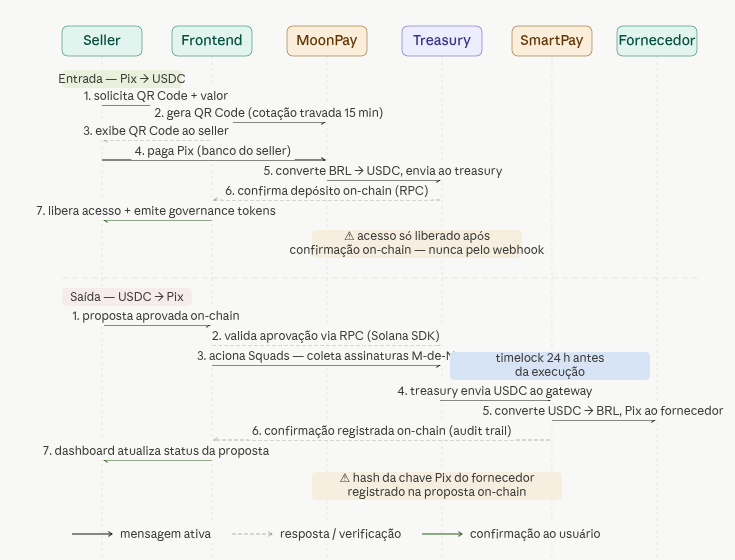

# Documentação da Solução - SellerDAO - Hackanation 2026 (3rd edition)

## Integrantes do time
- [Igor Rodrigues](https://www.linkedin.com/in/igor-dasilva-rodrigues/)
- [João Victor Penin Caldeira](https://www.linkedin.com/in/jvpenin/)
- [Messias Olivindo](https://www.linkedin.com/in/messias-olivindo/)

## Sumário

1. [1. Visão Geral](#1-visão-geral)
   * 1.1. [Problemática](#11-problemática)
   * 1.2. [Solução Proposta](#12-solução-proposta)
     * 1.2.1. [Como funciona na prática](#121-como-funciona-na-prática)
     * 1.2.2. [Por que Solana?](#122-por-que-solana)
     * 1.2.3. [Como funciona para o recebedor](#123-como-funciona-para-o-recebedor)
   * 1.3. [Value Proposition Canvas](#13-value-proposition-canvas)
2. [2. Análises de Mercado](#2-análises-de-mercado)
   * 2.1. [Matriz de Riscos](#21-matriz-de-riscos)
   * 2.2. [Matriz de Oportunidades](#212-matriz-de-oportunidades)
   * 2.3. [Modelo de 5 Forças de Porter](#22-modelo-de-5-forças-de-porter-sellerdao)
   * 2.4. [Estratégias de Inserção (Go-to-Market)](#23-estratégias-de-inserção-no-mercado-go-to-market-da-sellerdao)
   * 2.5. [Benchmark e Posicionamento Competitivo](#24-benchmark-e-posicionamento-competitivo)
   * 2.6. [Análise de Retorno sobre Investimento (ROI Y1)](#25-análise-de-retorno-sobre-investimento-roi-y1)
3. [3. Produto](#3-produto)
   * 3.1. [Personas](#31-personas)
   * 3.2. [Interface e Front-end (UX)](#32-interface-e-front-end)
4. [4. Arquitetura Técnica](#4-arquitetura-técnica)
   * 4.1. [Visão Geral da Arquitetura](#41-visão-geral-da-arquitetura)
   * 4.2. [Stack Tecnológico](#42-stack-tecnológico)
   * 4.3. [Lógica dos Programas Solana](#43-lógica-dos-programas-solana)
   * 4.4. [Limitações do MVP e Escopo](#44-limitações-do-mvp-e-escopo)
   * 4.5. [Fluxo de Pagamento Off-chain](#45-fluxo-de-pagamento-off-chain)
5. [5. Conclusão](#5-conclusão)
6. [6. Cronograma de Desenvolvimento (Roadmap)](#6-cronograma-de-desenvolvimento-roadmap)

---

# 1. Visão Geral
## 1.1. Problemática
&ensp; O seller pequeno de marketplace não perde para o concorrente por falta de produto, mas sim por custo de estrutura. Um seller que fatura R$ 30k/mês compra estoque pelo preço de balcão, anuncia no leilão mais caro, toma crédito a 4% ao mês e contrata creator de 50k seguidores porque é o que cabe no orçamento. Um seller que fatura R$ 3M/mês faz as mesmas quatro coisas com custo estruturalmente menor.

&ensp; A diferença nunca foi mérito, mas sim volume. O estoque mais barato vem de pedido mínimo que o microempreendedor não atinge. O CPM menor vem de verba que justifica mesa de negociação. O crédito mais barato vem de histórico bancário que leva anos para construir. O creator com audiência real cobra cachê que não faz sentido para o caixa de uma loja que vende 200 unidades por mês.
Nenhum desses problemas tem solução individual. São todos, por definição, problemas de escala. Até agora, escala só existia para quem já era grande.

&ensp; Há ainda um segundo problema, quando um grupo de sellers tenta resolver isso de forma tradicional, isto é, formando um grupo de compra, um fundo coletivo, qualquer tipo de estrutura compartilhada, alguém precisa guardar o dinheiro. Alguém precisa ser confiável o suficiente para gerir o capital que sustenta as familias que dependem daquele negócio. E é exatamente nesse eixo que esse tipo de iniciativa costuma quebrar, não há infraestrutura que elimine a dependência de confiança interpessoal ou possíveis golpes.

## 1.2. Solução Proposta
&ensp; A SellerDAO é uma infraestrutura financeira coletiva para sellers de marketplace, como Mercado Livre, Shopee, TikTok Shop e etc, construída sobre a Solana.

&ensp; A ideia central é permitir que sellers contribuam com um percentual do seu faturamento <strong>validado</strong> para um treasury compartilhado, votem em como usar esse capital, e o programa executa automaticamente. Ninguém irá armazenar o dinheiro ou distribuir os pagamentos, o código é o responsável. Enquanto isso, pequenos vendedores aumentam seu poder de barganha/negociação com os fornecedores e diminuem o custo de produção e distribuição dos produtos.

### 1.2.1. Como funciona na prática:

&ensp; O seller conecta a conta do marketplace à plataforma. A API dos marketplaces confirma as vendas realizadas. O sistema calcula a contribuição proporcional e gera uma cobrança: Pix, boleto, cartão ou USDC direto na Solana. Quando o pagamento é confirmado, o valor entra no treasury on-chain.

Marketplace API
↓
Backend SellerDAO
↓
Calcula contribuição (1% do faturamento validado)
↓
Gera cobrança (Pix / boleto / USDC)
↓
Treasury Solana
↓
Votação on-chain → execução automática

&ensp; O treasury acumula o capital e qualquer membro pode propor um uso, seja uma compra coletiva de estoque, contratação de creator para live no TikTok Shop, campanha de mídia em bloco, empréstimo interno para capital de giro. A proposta fica aberta 72 horas para votação. Aprovada, o programa executa sem intermediário.

### 1.2.2. Por que Solana?

&ensp; A SellerDAO depende de uma infraestrutura onde movimentar recursos, votar propostas e executar decisões coletivas seja tão simples quanto utilizar qualquer software tradicional. Por isso, blockchain é o que viabiliza nosso modelo.

&ensp; A Solana combina três características essenciais para a operação da SellerDAO. A primeira é o custo extremamente baixo das transações, permitindo que contribuições, votações e distribuições ocorram sem criar atrito para os membros da comunidade. A segunda é a velocidade de confirmação, que possibilita uma experiência praticamente instantânea para ações de governança e movimentação de recursos. A terceira é seu ecossistema financeiro já consolidado, com suporte nativo a USDC, ferramentas maduras de governança, multisigs e infraestrutura de pagamentos.

&ensp; Além da performance da rede, a Solana oferece um ecossistema de desenvolvimento que reduz significativamente a complexidade de implementação. Ferramentas como Anchor, SPL Tokens e Squads permitem construir tesourarias, sistemas de governança e mecanismos de controle financeiro utilizando componentes amplamente testados pelo mercado, acelerando o desenvolvimento e aumentando a segurança da solução.

&ensp; Por fim, a forte presença de stablecoins na Solana torna possível conectar o ambiente on-chain com operações do mundo real. Isso permite que recursos sejam administrados digitalmente dentro da DAO enquanto fornecedores, creators e parceiros continuam recebendo por meios tradicionais, como Pix, sem precisar interagir diretamente com blockchain.

&ensp; A blockchain Solana foi escolhida por ser rápida e reunir, em uma única infraestrutura, custo operacional baixo, experiência de uso fluida e um ecossistema financeiro capaz de sustentar uma organização econômica formada por centenas de sellers independentes.

### 1.2.3. Como funciona para o recebedor

&ensp; Fornecedores, transportadoras, atacadistas, creators não precisam saber que existe blockchain. O sistema gera uma wallet custodial vinculada ao CNPJ deles e usa uma integração com fintech brasileira para converter USDC em BRL e depositar via Pix na conta bancária deles. Recebem como se fosse uma transferência normal.

&ensp; O pagamento sai do treasury via Squads Protocol, um programa de multisig nativo da Solana. Nenhuma pessoa tem a chave privada do treasury. O pagamento só executa quando M-de-N membros assinam, automaticamente, ao atingir o threshold.

## 1.3. Value Proposition Canvas

&ensp; O Value Proposition Canvas é uma ferramenta de modelagem estratégica utilizada para analisar como um produto ou serviço gera valor para um público específico. Seu objetivo é alinhar a proposta de valor da solução às necessidades, dores e expectativas do cliente, assegurando que o produto resolva problemas relevantes e entregue benefícios claros. Segue o nosso modelo:

Figura 1 – Canvas de proposta de valor.

Fonte: Próprios autores (2026).

# 2. Análises de Mercado

## 2.1. Matriz de Riscos

A Matriz de Riscos é uma ferramenta visual utilizada para priorizar os riscos de um projeto com base em duas dimensões: probabilidade, que mede a chance de um risco ocorrer, e impacto, que representa suas consequências caso se concretize (PROJECT MANAGEMENT INSTITUTE, 2017). A combinação dessas dimensões gera uma classificação geral — alta, média ou baixa — representada por cores, facilitando o foco da equipe nos riscos mais críticos e orientando a construção de planos de ação preventivos. No contexto deste projeto, a matriz foi aplicada para avaliar os riscos do desenvolvimento da plataforma da SellerDAO, considerando desde vulnerabilidades técnicas e desafios de governança até exposições regulatórias inerentes ao modelo de negócio proposto. Segue o nosso modelo:

Figura 2 – Matriz de riscos.

Fonte: Próprios autores (2026).

---

### Risco de Erro no Oráculo Próprio (Backend → Solana)

Trata-se de um risco de natureza técnica. Sua probabilidade de ocorrência foi estimada em 50%, pois, por não se tratar de um serviço padronizado de terceiros, a implementação está mais sujeita a bugs, falhas de sincronização ou divergências entre os dados off-chain (APIs dos marketplaces) e os snapshots on-chain. O impacto foi classificado como alto porque, caso esse risco se concretize, o cálculo de contribuição dos sellers pode ser comprometido, gerando cobranças injustas, contestações e perda de confiança na plataforma. A combinação desses fatores resulta em uma classificação geral alta. Como plano de ação, a equipe deve implementar testes automatizados periódicos que comparam dados off-chain e on-chain, iniciar com snapshots mensais mais agregados para reduzir complexidade e definir um processo formal de reconciliação e correção via proposta de governança sempre que uma divergência for detectada.

---

### Risco de Dependência das APIs de Marketplaces

Trata-se de um risco de natureza técnica e de negócio. Sua probabilidade de ocorrência foi estimada em 50%, pois mudanças de política, revisão de credenciais ou limites de requisições por parte dos marketplaces são eventos plausíveis ao longo do ciclo de vida do produto. O impacto foi classificado como alto porque, caso esse risco se concretize, a SellerDAO perde a capacidade de validar automaticamente o faturamento, travando o cálculo de contribuição e, consequentemente, as operações de governança que dependem dessas informações. A combinação desses fatores resulta em uma classificação geral alta. Como plano de ação, a equipe deve focar o MVP em no máximo dois marketplaces com APIs mais estáveis, construir uma camada de abstração de integrações no backend, isolando cada API em módulos independentes, e prever um "modo degradado" que suspende propostas dependentes de faturamento atualizado enquanto a integração estiver indisponível.

---

### Risco de Bug em Programas Solana (Smart Contracts)

Trata-se de um risco de natureza de segurança. Sua probabilidade de ocorrência foi estimada em 30%, pois depende fortemente da qualidade do desenvolvimento, mas vulnerabilidades in contracts on-chain, mesmo sutis, são um vetor de risco clássico e amplamente documentado no ecossistema DeFi: foram registrados US$ 1,42 bilhão em perdas em 149 incidentes documentados somente em 2024, com falhas de controle de acesso respondendo por US$ 953,2 milhões desse total (OWASP FOUNDATION, 2025). O impacto foi classificado como crítico porque, caso esse risco se concretize, fundos em USDC podem ser perdidos de forma definitiva ou a tesouraria pode ser travada sem possibilidade de recuperação, inviabilizando toda a operação da DAO. A combinação desses fatores resulta em uma classificação geral alta a crítica, tornando este o risco de maior severidade potencial do projeto. Como plano de ação, a equipe deve utilizar ao máximo componentes já testados e auditados do ecossistema Solana, como Anchor, SPL Tokens e Squads, implementar spending limits e time locks para transações de alto valor e, assim que houver versão estável, realizar uma revisão externa do código por parceiros ou pela comunidade.

---

### Risco de Configuração Inadequada do Multisig Squads

Trata-se de um risco de natureza de segurança e governança. Sua probabilidade de ocorrência foi estimada em 50%, pois a definição correta do threshold de aprovação e da composição de signers é altamente sensível ao contexto e está sujeita a erros de calibração na fase inicial. O impacto foi classificado como alto porque, caso esse risco se concretize, um threshold baixo demais permite que poucos signers capturem a tesouraria, enquanto um threshold alto demais pode travar a DAO se signers ficarem inativos, em ambos os cenários, a integridade operacional e financeira da organização é comprometida. A combinação desses fatores resulta em uma classificação geral alta. Como plano de ação, a equipe deve iniciar com um conjunto misto de signers, time core mais sellers representativos, definir regras de rotação periódica, utilizar spending limits e time locks para saídas de grande valor e documentar formalmente os critérios de escolha e substituição de signers na própria governança da DAO.

---

### Risco de Enquadramento como VASP sem Licença

Trata-se de um risco de natureza regulatória. Sua probabilidade de ocorrência foi estimada em 50%, pois o modelo da SellerDAO, que envolve custódia coletiva de USDC, contribuições financeiras e execução de pagamentos, pode ser interpretado como atividade de VASP. A Lei 14.478/2022, em vigor desde agosto de 2023, estabeleceu o marco legal para prestadores de serviços de ativos virtuais no Brasil, e em 2025 o Banco Central assumiu formalmente a supervisão das corretoras de criptomoedas, tornando o cenário regulatório progressivamente mais exigente (O MUNICÍPIO, 2026). O impacto foi classificado como alto a crítico porque, caso esse risco se concretize, a pessoa jurídica representante pode ser obrigada a interromper operações, obter autorização específica do Bacen ou reestruturar completamente o modelo de negócio. A combinação desses fatores resulta em uma classificação geral alta. Como plano de ação, a equipe deve documentar explicitamente que a implementação real exigirá parecer jurídico especializado e adequação à Lei 14.478/2022, e estruturar o modelo para que conversões entre BRL e USDC sejam realizadas por parceiros financeiros já licenciados, reduzindo o escopo regulatório da PJ.

---

### Risco de KYC/AML Insuficiente

Trata-se de um risco de natureza regulatória e reputacional. Sua probabilidade de ocorrência foi estimada em 30%, pois a intenção declarada de realizar um KYC elaborado reduz o risco, mas não o elimina, falhas de processo, fornecedores inadequados ou ausência de monitoramento transacional contínuo podem deixar brechas relevantes. Em 2025, o Banco Central intensificou a exigência de identificação obrigatória de usuários e regras reforçadas de prevenção à lavagem de dinheiro para todo o setor de ativos virtuais (O MUNICÍPIO, 2026). O impacto foi classificado como alto porque, caso esse risco se concretize, a DAO pode ser utilizada para movimentação indevida de recursos, atraindo sanções regulatórias, responsabilidade criminal para os administradores e dano irreparável à reputação da plataforma. A combinação desses fatores resulta em uma classificação geral alta. Como plano de ação, a equipe deve adotar processos formais de KYC/KYB com CNPJ, documentos societários e screening em listas de sanções, utilizando provedores especializados; implementar monitoramento transacional básico para detectar padrões atípicos; e garantir que operações de conversão fiat-cripto sejam feitas exclusivamente por instituições já reguladas.

---

### Risco de Conflito com o Código de Defesa do Consumidor

Trata-se de um risco de natureza regulatória. Sua probabilidade de ocorrência foi estimada em 30%, pois, embora a SellerDAO opere em modelo B2B com sellers pessoas jurídicas, parte dos participantes pode ser enquadrada como consumidor vulnerável dependendo do contexto e do entendimento do regulador. O impacto foi classificado como moderado a alto porque, caso esse risco se concretize, a SellerDAO pode ser responsabilizada por falta de transparência nas taxas, ausência de informações sobre riscos ou assimetria contratual, gerando litígios e obrigações de adequação. A combinação desses fatores resulta em uma classificação geral média. Como plano de ação, a equipe deve desenvolver termos de uso claros e acessíveis, além de materiais educativos que expliquem os riscos e o caráter coletivo e de autogovernança da DAO, sem qualquer promessa ou garantia de retorno financeiro.

---

### Risco de Concentração de Poder de Voto

Trata-se de um risco de natureza de governança. Sua probabilidade de ocorrência foi estimada em 70%, pois, sem mecanismos de limitação, a concentração de poder de voto nos sellers de maior faturamento é quase inevitável em DAOs com voto proporcional puro. Dados mostram que apenas 1% dos detentores de tokens concentrava 90% do poder de voto em 10 grandes projetos de DAO analisados (CHAINALYSIS apud BERAVOTE, 2023), evidenciando como esse desequilíbrio é estrutural e não excepcional. A SellerDAO, por atender sellers com faturamentos muito heterogêneos, está especialmente exposta a essa dinâmica. O impacto foi classificado como alto porque, caso esse risco se concretize, decisões estratégicas da DAO podem ser capturadas por um grupo pequeno de sellers grandes, marginalizando os menores e subvertendo a proposta de infraestrutura financeira coletiva e equitativa. A combinação desses fatores resulta em uma classificação geral alta, tornando este um dos riscos mais estruturais do projeto. Como plano de ação, a equipe deve estabelecer desde o início um limite máximo de poder de voto por entidade, explorar modelos híbridos de câmaras separadas para decisões de diferentes naturezas e prever mecanismo de revisão periódica das regras de governança via proposta da própria comunidade.

---

### Risco de Baixa Participação em Votações (Apathy Risk)

Trata-se de um risco de natureza de governança e operacional. Sua probabilidade de ocorrência foi estimada em 70%, pois sellers de marketplace são empreendedores com alta demanda operacional no dia a dia, tornando improvável que a maioria se engaje ativamente em votações de governança de forma contínua. Esse fenômeno é amplamente documentado: em média, menos de 10% dos detentores de tokens participam de votações relevantes nas DAOs (BERAVOTE, 2024), e em casos como o Uniswap, uma das maiores DAOs do mundo, a taxa média de participação registrada foi de apenas 0,33% dos elegíveis (LIU, 2023). Baixa participação e fadiga de governança têm levado à centralização das decisões nas mãos de poucos participantes altamente ativos (ÖZDEMIR et al. apud FRONTIERS IN BLOCKCHAIN, 2025). O impacto foi classificado como moderado a alto porque, caso esse risco se concretize, a legitimidade das decisões da DAO fica comprometida, aumentando o risco de captura por minoria e de desengajamento progressivo da comunidade. A combinação desses fatores resulta em uma classificação geral alta. Como plano de ação, a equipe deve definir quórum mínimo por tipo de decisão, criar incentivos de participação, como benefícios extras para membros engajados, e investir em uma UX simples de votação com notificações por e-mail e WhatsApp.

---

### Risco de Critérios de Reembolso Pouco Definidos

Trata-se de um risco de natureza de governança e jurídica. Sua probabilidade de ocorrência foi estimada em 50%, pois, sem critérios claros e formalizados para quando e como o reembolso é possível, a DAO fica exposta a demandas inconsistentes, conflitos internos e à percepção de que a tesouraria funciona como uma "seguradora informal". O impacto foi classificado como alto porque, caso esse risco se concretize, a credibilidade da governança da DAO pode ser severamente abalada, e decisões tomadas de forma casuística podem criar precedentes prejudiciais ao funcionamento sustentável da comunidade. A combinação desses fatores resulta em uma classificação geral alta. Como plano de ação, a equipe deve especificar no regulamento interno os casos em que o reembolso é elegível, como fraude comprovada ou não entrega documentada, e os casos em que não é, além de exigir contratos ou termos mínimos entre a DAO e fornecedores e creators para embasar qualquer decisão de reembolso.

---

### Risco de Barreira no Onboarding via USDC

Trata-se de um risco de natureza de produto e operacional. Sua probabilidade de ocorrência foi estimada em 70%, pois a maioria dos pequenos sellers de marketplaces brasileiros ainda tem baixa exposição a ativos digitais, tornando o processo de onboarding com USDC e carteiras cripto uma barreira real de adoção. Segundo pesquisa do Sebrae, 2/3 dos pequenos negócios brasileiros concentram-se entre os níveis baixo e médio de maturidade digital, e os MEIs puxam a média nacional para baixo (SEBRAE, 2024), evidenciando que o público-alvo da SellerDAO ainda está longe da familiaridade necessária para operar diretamente com ativos on-chain. O impacto foi classificado como moderado a alto porque, caso esse risco se concretize, a base de sellers elegíveis fica artificialmente reduzida, comprometendo a escala necessária para que os ganhos de poder de barganha e tesouraria coletiva se materializem. A combinação desses fatores resulta em uma classificação geral alta. Como plano de ação, o MVP deve assumir explicitamente que o foco inicial são sellers com maior maturidade digital, enquanto a visão de longo prazo inclui integração com fintechs que abstraiam a conversão BRL para USDC, além de materiais educativos simples que guiem os primeiros participantes no passo a passo de entrada na plataforma.

---

### Risco de Modelo de Receita e Sustentabilidade Indefinidos

Trata-se de um risco de natureza de negócio. Sua probabilidade de ocorrência foi estimada em 70%, pois, em estágio de MVP e hackathon, é natural que o foco esteja na validação do valor entregue aos sellers, deixando a monetização para fases posteriores, o que mantém o risco de sustentabilidade financeira da operação em aberto por mais tempo. O impacto foi classificado como moderado a alto porque, caso esse risco se concretize, a DAO pode crescer em tesouraria coletiva mas não ter recursos suficientes para manter a equipe de operação, resultando em degradação do produto e abandono da plataforma. A combinação desses fatores resulta em uma classificação geral média a alta. Como plano de ação, a equipe deve documentar explicitamente que o MVP tem como objetivo validar valor para os sellers, e que o modelo de monetização, como uma pequena taxa sobre operações aprovadas, será testado in fases posteriores, separando desde já a tesouraria da comunidade da tesouraria operacional da PJ.

---

### Risco de Gestão de Dados Sensíveis e LGPD

## 2.1.2 Matriz de Oportunidades

A Matriz de Oportunidades é uma ferramenta visual complementar à Matriz de Riscos, utilizada para identificar e priorizar fatores externos e internos que podem ser explorados em benefício do projeto (PROJECT MANAGEMENT INSTITUTE, 2017). Assim como nos riscos, as oportunidades são avaliadas a partir de duas dimensões — probabilidade de ocorrência e potencial de impacto positivo —, gerando uma classificação geral que orienta a equipe a concentrar esforços nas frentes de maior retorno estratégico. No contexto deste projeto, a matriz foi aplicada para mapear as oportunidades associadas à plataforma da SellerDAO, abrangendo desde ganhos econômicos diretos para os sellers até vantagens competitivas de posicionamento, tecnologia e comunidade. Segue o nosso modelo:

Figura 3 – Matriz de oportunidades.

Fonte: Próprios autores (2026).

---

### Oportunidade de Ganho de Poder de Barganha em Compras de Estoque

Trata-se de uma oportunidade de natureza econômica e estratégica. Sua probabilidade de ocorrência foi estimada em 70%, pois ao consolidar as contribuições de múltiplos sellers, a SellerDAO atinge volumes de compra que individualmente seriam inacessíveis para pequenos e médios vendedores, criando condições reais para negociação de preços de atacado. O impacto foi classificado como alto porque, caso essa oportunidade se concretize, a DAO resolve diretamente a assimetria estrutural de custos que é um dos problemas centrais dos pequenos sellers de marketplaces, aumentando suas margens e competitividade. A combinação desses fatores resulta em uma classificação geral alta, tornando esta a oportunidade mais diretamente alinhada com a proposta de valor central da SellerDAO. Como plano de ação, a equipe deve construir um exemplo numérico concreto na documentação — por exemplo, 100 sellers faturando R$30 mil por mês cada, demonstrando o volume consolidado e os ganhos potenciais de negociação com fornecedores.

---

### Oportunidade de Mídia e Creators Mais Baratos via Blocos Coletivos

Trata-se de uma oportunidade de natureza econômica e de marketing. Sua probabilidade de ocorrência foi estimada em 70%, pois a mesma lógica de escala que viabiliza compras coletivas de estoque também se aplica a campanhas com creators e mídia paga em plataformas como TikTok Shop e Meta Ads, onde CPM e CPC menores são diretamente acessíveis a quem negocia volumes maiores. O impacto foi classificado como alto porque, caso essa oportunidade se concretize, os sellers da DAO podem acessar creators com maior alcance e campanhas com melhor retorno sobre investimento, ampliando sua capacidade de geração de receita sem aumento proporcional de custo. A combinação desses fatores resulta em uma classificação geral alta. Como plano de ação, a equipe deve mapear, ainda na fase de MVP, os formatos de compra coletiva de mídia e parcerias com creators que podem ser viabilizados por meio da tesouraria, apresentando isso como um diferencial competitivo da DAO.

---

### Oportunidade de Crédito Mais Barato via Fundo Interno de Giro

Trata-se de uma oportunidade de natureza financeira. Sua probabilidade de ocorrência foi estimada em 50%, pois a viabilidade de um fundo interno de giro depende da escala da tesouraria e da maturidade da governança da DAO, fatores que ainda precisam ser validados. O impacto foi classificado como alto porque, caso essa oportunidade se concretize, os sellers da DAO podem acessar crédito a taxas significativamente menores do que as praticadas por bancos tradicionais: a taxa média de juros para MEIs no Brasil é de 44,04% ao ano, mais de quatro vezes a taxa Selic —, chegando a 51% ao ano na Região Nordeste (SEBRAE; BANCO CENTRAL DO BRASIL, 2024). A SellerDAO pode oferecer uma alternativa interna com custo e transparência muito superiores. A combinação desses fatores resulta em uma classificação geral alta. Como plano de ação, a equipe deve incluir no roadmap do produto, como fase posterior ao MVP, a especificação de um módulo de crédito interno com regras claras de elegibilidade, limite de exposição e recuperação em caso de inadimplência.

---

### Oportunidade de Infraestrutura Pioneira de DAO para Sellers na América Latina

Trata-se de uma oportunidade de natureza estratégica e de posicionamento. Sua probabilidade de ocorrência foi estimada em 70%, pois o mercado de sellers de marketplaces na América Latina ainda não possui uma estrutura equivalente de DAO com tesouraria on-chain e governança proporcional à contribuição, criando uma janela de oportunidade real de first-mover. O impacto foi classificado como muito alto porque, caso essa oportunidade se concretize, a SellerDAO pode se tornar referência continental em infraestrutura financeira coletiva para o e-commerce independente, atraindo atenção de investidores, fundos de Web3 e parceiros institucionais muito além do escopo inicial do hackathon. A combinação desses fatores resulta em uma classificação geral alta, tornando esta a oportunidade de maior potencial de impacto estratégico do projeto. Como plano de ação, a equipe deve posicionar explicitamente a SellerDAO como infraestrutura pioneira na documentação e nas apresentações, reforçando a combinação única de DAO, Solana, marketplaces tradicionais e compliance brasileiro.

---

### Oportunidade de Diferenciação por Segurança com Multisig Squads

Trata-se de uma oportunidade de natureza tecnológica e reputacional. Sua probabilidade de ocorrência foi estimada em 90%, pois a adoção do Squads protocolo multisig formalmente verificado e consolidado como padrão de segurança para tesourarias na Solana, é uma decisão técnica diretamente no controle da equipe e pode ser comunicada como diferencial desde o primeiro dia. O impacto foi classificado como moderado a alto porque, caso essa oportunidade se concretize, a SellerDAO ganha uma narrativa forte de robustez e transparência frente a modelos centralizados, aumentando a confiança dos sellers para aportar capital coletivo na plataforma. A combinação desses fatores resulta em uma classificação geral alta. Como plano de ação, a equipe deve destacar o uso do Squads como pilar de segurança nas apresentações e na documentação técnica, explicando de forma acessível para sellers não técnicos o que significa ter uma tesouraria multisig auditável on-chain.

---

### Oportunidade de Dados Agregados como Ativo Estratégico

Trata-se de uma oportunidade de natureza tecnológica e de produto. Sua probabilidade de ocorrência foi estimada em 70%, pois os snapshots on-chain e os registros off-chain de faturamento e contribuição acumulados ao longo do tempo geram uma base de dados única sobre comportamento de compra, sazonalidade e performance de sellers de marketplaces, produzida naturalmente como subproduto do funcionamento da DAO. O impacto foi classificado como moderado a alto porque, caso essa oportunidade se concretize, a SellerDAO pode transformar essa inteligência em insumo para negociação com fornecedores, scoring de crédito interno e futuros produtos de analytics — criando uma vantagem competitiva difícil de replicar. A combinação desses fatores resulta em uma classificação geral alta. Como plano de ação, a equipe deve projetar desde o início a estrutura de dados pensando em analytics futuros, garantindo que os snapshots on-chain registrem informações suficientes para análises de tendência sem comprometer privacidade e compliance.

---

### Oportunidade de Comunidade com Governança Real sobre Capital Coletivo

Trata-se de uma oportunidade de natureza organizacional e de comunidade. Sua probabilidade de ocorrência foi estimada em 70%, pois a substituição de associações informais baseadas em confiança interpessoal por regras explícitas de governança, votações transparentes e execução automática via programas Solana (smart contracts) resolve um problema estrutural real citado na problemática do projeto — a vulnerabilidade de grupos de compra informais a golpes e má gestão. O impacto foi classificado como alto porque, caso essa oportunidade se concretize, a SellerDAO pode criar uma comunidade de sellers genuinamente engajada, com senso de ownership sobre o capital coletivo e confiança na imparcialidade das decisões, o que é um ativo intangível de altíssimo valor para a sustentabilidade de longo prazo da DAO. A combinação desses fatores resulta em uma classificação geral alta. Como plano de ação, a equipe deve comunicar ativamente, nas apresentações e materiais de onboarding, a diferença entre a governança on-chain da SellerDAO e os grupos informais de compra coletiva, reforçando a transparência e a auditabilidade como diferenciais centrais.

---

### Oportunidade de Parcerias com Fintechs e Provedores Regulados

Trata-se de uma oportunidade de natureza estratégica e financeira. Sua probabilidade de ocorrência foi estimada em 50%, pois, ao estruturar-se adequadamente em termos de compliance, KYC/AML e modelo jurídico, a SellerDAO se torna um parceiro atraente para fintechs que desejam entrar no segmento de cripto e DAOs no Brasil de forma segura e regulatoriamente embasada. O impacto foi classificado como moderado a alto porque, caso essa oportunidade se concretize, parcerias com fintechs reguladas podem resolver a barreira de onboarding em USDC — ao abstrair a conversão BRL-USDC — e ampliar significativamente o alcance e a credibilidade da plataforma junto a sellers com menor maturidade cripto. A combinação desses fatores resulta em uma classificação geral média a alta. Como plano de ação, a equipe deve mapear fintechs brasileiras com atuação em cripto e licenciamento adequado, iniciar conversas exploratórias e incluir na documentação a integração com parceiros regulados como parte do roadmap de crescimento da SellerDAO.

---
## 2.2 Modelo de 5 Forças de Porter (SellerDAO)

As Cinco Forças de Porter são utilizadas para analisar a competitividade de um mercado através de cinco dimensões estratégicas. Nesta seção, essa metodologia foi aplicada para compreender o contexto competitivo da SellerDAO e alinhar o desenvolvimento da solução ao ambiente de pequenos sellers de marketplaces na América Latina, considerando tanto o ecossistema de plataformas digitais quanto o surgimento de estruturas descentralizadas como DAOs (PORTER, 1979).

### Rivalidade entre concorrentes existentes
A SellerDAO atua na interseção entre serviços financeiros coletivos, infraestrutura cripto e soluções para sellers de marketplaces como Mercado Livre, Shopee e TikTok Shop. Na prática, ela concorre indiretamente com bancos e fintechs que oferecem crédito, ERPs e hubs de integração que prometem ganho de eficiência, programas de compra coletiva informais entre lojistas e iniciativas dos próprios marketplaces para apoiar vendedores estratégicos. A rivalidade é classificada como moderada, pois já existem alternativas que atacam partes do problema — crédito, automação, negociação individual —, mas ainda são raras as soluções que combinam tesouraria coletiva, governança compartilhada e foco explícito em reduzir assimetrias de escala para pequenos sellers por meio de uma DAO sobre blockchain (SALESFORCE, 2024).

### Poder de barganha dos fornecedores
No contexto da SellerDAO, os fornecedores são os agentes dos quais a operação depende diretamente para existir: infraestrutura de blockchain (Solana), protocolos de tesouraria e segurança (como Squads), APIs dos marketplaces (Mercado Livre, Shopee, TikTok Shop), provedores de KYC/AML e, em estágios posteriores, exchanges ou fintechs responsáveis pela liquidez em USDC. A concentração de poder em alguns desses elos — por exemplo, poucos grandes provedores de infraestrutura cripto regulada e o controle exclusivo das APIs pelos próprios marketplaces — faz com que mudanças de política, preços ou condições técnicas possam impactar de forma significativa a capacidade da SellerDAO de operar e escalar, resultando em um poder de barganha dos fornecedores classificado como alto. Nesse cenário, a arquitetura proposta — uso de componentes amplamente adotados no ecossistema Solana, desenho modular de integrações e, no futuro, parcerias com múltiplos provedores regulados — funciona como estratégia para reduzir lock-in tecnológico e diluir o poder de negociação concentrado nesses atores críticos.

### Poder de barganha dos clientes (sellers membros da DAO)
Os "clientes" da SellerDAO são pequenos e médios sellers que faturam relativamente pouco de forma individual, compram estoque a preço de balcão, contratam mídia cara e acessam crédito com juros elevados. Apesar de terem pouco poder de barganha frente a bancos, marketplaces e grandes fornecedores, esses sellers possuem alto poder de escolha em relação à própria SellerDAO: podem simplesmente não aderir, reduzir sua contribuição ou migrar para alternativas mais simples, como crédito tradicional ou soluções SaaS que exijam menor mudança de comportamento. Por isso, o poder de barganha dos clientes é considerado alto do ponto de vista da DAO, exigindo que a solução entregue benefícios econômicos mensuráveis — melhor preço de estoque, mídia mais barata, acesso a crédito interno mais justo — e uma experiência de uso que abstraia a complexidade de blockchain para garantir adesão e permanência (BUSINESS INSIDER, 2022).

### Ameaça de novos entrantes
A ameaça de novos entrantes é classificada como média a alta. Do lado tecnológico, projetos de DAO e tesouraria on-chain podem ser replicados com relativa rapidez por outras equipes, já que o ecossistema de DeFi e DAOs fornece frameworks e componentes reutilizáveis. Por outro lado, construir uma comunidade engajada de sellers com volume financeiro suficiente para negociar em bloco e histórico de governança confiável é um processo incremental e lento, o que cria barreiras de entrada baseadas em reputação, dados acumulados e relações com fornecedores e fintechs parceiras. Fintechs tradicionais, bancos digitais e até os próprios marketplaces podem tentar lançar soluções similares — fundos coletivos, crédito melhorado, programas de compra conjunta —, usando sua marca e acesso privilegiado a dados para competir, o que torna estratégico para a SellerDAO consolidar-se rapidamente como referência nesse nicho específico de infraestrutura coletiva para sellers de marketplace (CHEN et al., 2023).

### Ameaça de produtos substitutos
A ameaça de produtos substitutos é alta. Os problemas que a SellerDAO busca resolver — acesso a melhores condições de compra de estoque, mídia mais eficiente e crédito menos oneroso — também podem ser atacados por linhas de crédito tradicionais, cooperativas de crédito, associações de lojistas, consórcios empresariais, programas de incentivo dos próprios marketplaces e plataformas de educação e apoio ao seller oferecidas por grandes empresas de tecnologia. Além disso, iniciativas centralizadas que ofereçam benefícios de clube para pequenos comerciantes, sem expor o usuário a conceitos de cripto, podem ser percebidas como soluções mais simples por parte do público. A vantagem competitiva da SellerDAO depende, portanto, da capacidade de oferecer uma combinação difícil de replicar: transparência de uso dos recursos via blockchain, governança efetivamente compartilhada e ganhos econômicos concretos para o pequeno seller, mantendo ao mesmo tempo uma camada de experiência que esconda a complexidade técnica e preserve a sensação de familiaridade com meios de pagamento tradicionais (SEMRUSH, 2023).

## 2.3. Estratégias de Inserção no Mercado (Go-to-Market da SellerDAO)

A estratégia de go-to-market da SellerDAO segue uma lógica faseada: começar focado, gerar provas de valor mensuráveis e crescer a partir de resultados concretos (BLANK; DORF, 2012). A implementação inicial é concentrada em um único marketplace — preferencialmente o Mercado Livre — para validar a integração técnica, o fluxo de contribuição para a tesouraria e a viabilidade da primeira operação coletiva antes de qualquer expansão.

## Fase 1 — Piloto (Meses 1–2) 
Validação técnica e de valor com 10 a 20 sellers selecionados. O piloto é considerado bem-sucedido ao concluir ao menos uma operação coletiva completa — como uma compra conjunta de estoque com economia de pelo menos 10% em relação ao preço individual — sem incidentes críticos de integração.

## Fase 2 — Beta Fechado (Meses 3–5)
 Ampliação para 50 a 150 sellers. A aquisição desses primeiros usuários ocorre por meio de canais onde vendedores de marketplace já se reúnem organicamente, grupos no WhatsApp, comunidades no Facebook e fóruns especializados, levando a proposta da SellerDAO diretamente ao ambiente em que esse público já está. A proposta de valor é comunicada em linguagem de negócio "comprar estoque mais barato junto, negociar mídia em bloco, acessar crédito mais justo", abstraindo deliberadamente a camada técnica de blockchain. Os participantes co-constroem as regras de governança e se tornam os primeiros embaixadores da DAO.

## Fase 3 — Expansão (Mês 6 em diante):  
Com casos reais documentados, o crescimento passa a ser impulsionado por community-led growth (OPENVIEW, 2021)  depoimentos, indicações entre sellers e conteúdo baseado em evidências de economia gerada. Em paralelo, a integração com novos marketplaces como Shopee e TikTok Shop é iniciada de forma gradual, replicando o modelo técnico e operacional validado nas fases anteriores e ampliando o alcance da DAO para sellers de outras plataformas.

## 2.4. Benchmark e Posicionamento Competitivo

O mercado em que a SellerDAO se insere é composto por três blocos de soluções que atacam partes do problema enfrentado por pequenos sellers de marketplaces: grupos de compra e cooperativas, fintechs e soluções financeiras para sellers, e DAOs e tesourarias coletivas em Web3. Nenhum desses blocos, isoladamente, entrega a combinação que a SellerDAO propõe, poder de compra coletivo, financiamento, governança compartilhada e execução automática on-chain focada em sellers de marketplace.

A tabela a seguir sintetiza as principais características de cada bloco e o posicionamento da SellerDAO frente a eles:

| Critério | GPOs e Cooperativas | Fintechs e Marketplaces | DAOs Web3 | **SellerDAO** |
|---|---|---|---|---|
| Poder de compra coletivo | ✅ | ❌ | ❌ | ✅ |
| Foco em sellers de marketplace | ⚠️ Parcial | ✅ | ❌ | ✅ |
| Crédito e capital de giro | ❌ | ✅ | ❌ | ✅ (fase futura) |
| Tesouraria coletiva on-chain | ❌ | ❌ | ✅ | ✅ |
| Governança pelos próprios sellers | ❌ | ❌ | ✅ | ✅ |
| Integração com APIs de marketplaces | ❌ | ✅ | ❌ | ✅ |
| Abstração de blockchain para o usuário | ❌ | ❌ | ❌ | ✅ |
| Transparência de caixa auditável | ❌ | ❌ | ✅ | ✅ |

A SellerDAO se posiciona como uma camada de infraestrutura financeira coletiva que nenhum dos três blocos existentes cobre integralmente: resolve o mesmo problema de escala das cooperativas, mas com tesouraria programável e governança granular; acessa os dados de faturamento dos marketplaces como as fintechs, mas com o capital pertencendo e sendo gerido pelos próprios sellers; e utiliza a estrutura de DAO e execução on-chain do ecossistema Web3, mas aplicada a um problema concreto do e-commerce tradicional, com abstração total da camada cripto para o usuário final.

## 2.5. Análise de Retorno sobre Investimento (ROI Y1)

### Metodologia

O ROI Y1 da SellerDAO é calculado sob a perspectiva dos sellers membros — ou seja, o retorno que o conjunto de participantes obtém no primeiro ano de operação em relação ao investimento de implantação e operação da plataforma. A estrutura segue uma lógica de drivers de benefício bruto, filtros conservadores e subtração de custos operacionais, conforme metodologia adaptada de avaliações de impacto econômico (BLANK; DORF, 2012).

---

### Premissas e validação por benchmark

As premissas abaixo foram calibradas com base em dados de mercado e benchmarks de GPOs (Group Purchasing Organizations), que são a referência mais próxima ao modelo de compra coletiva da SellerDAO.

**Premissas da base de sellers:**

| Parâmetro | Valor adotado | Validação |
|---|---|---|
| Sellers no piloto | 100 | Premissa conservadora para Y1 |
| Faturamento médio mensal por seller | R$ 30.000 | Referência para sellers ativos de pequeno porte em marketplaces brasileiros |
| CMV (% do faturamento) | 55% | Faixa típica do varejo online brasileiro é 50–65%; adotamos o ponto médio conservador (HIPER.COM.BR, 2024) |
| Gasto mensal em mídia por seller | R$ 3.000 | Premissa estimada; a validar com sellers reais no piloto |

> **Ajuste importante:** o ROI original propunha CMV de 65%, valor mais alto da faixa. Adotamos 55% para maior conservadorismo, reduzindo o benefício bruto estimado e tornando o ROI mais defensável frente a avaliadores.

**Premissas de adoção no Y1:**

| Parâmetro | Valor adotado | Validação |
|---|---|---|
| Volume de estoque via DAO | 30% do total | Conservador para ano 1 de rampa |
| Volume de mídia coordenado via DAO | 10% do total | Conservador; pilotos iniciais de campanhas em bloco |

**Premissas de ganho e benchmark de GPOs:**

| Parâmetro | Valor adotado | Benchmark de mercado |
|---|---|---|
| Desconto médio em compras coletivas | 10% | GPOs tipicamente entregam 10–25% de economia anual (PROCUREMENT PARTNERS, 2025; AMAZON BUSINESS, 2026); adotamos o limite inferior da faixa |
| Ganho econômico em mídia | 5% | Premissa estimada conservadora; a validar no piloto |

> **Validação do desconto de 10%:** múltiplos benchmarks de GPOs confirmam que organizações que utilizam poder de compra coletivo economizam entre 10% e 25% ao ano em suas categorias de gasto (PROCUREMENT PARTNERS, 2025). O limite inferior de 10% adotado aqui está bem ancorado e é defensável como premissa conservadora de Y1.

**Filtros aplicados:**

| Filtro | Valor | Justificativa |
|---|---|---|
| Fator de atribuição (M1) | 60% | Parte do ganho é atribuída à gestão do próprio seller, não à DAO |
| Haircut de execução (M2) | 30% | Risco de execução e curva de aprendizado no Y1 |

**Custo de implantação e operação Y1:** R$ 500.000 (desenvolvimento, infraestrutura e operação do MVP).

---

### Cálculo do cenário base

**Driver A — Economia em estoque (compra coletiva):**

- Volume anual de estoque por seller: R$ 30.000 × 12 × 55% = R$ 198.000
- Volume via DAO (30% de adoção): R$ 198.000 × 30% = R$ 59.400 por seller
- Volume total para 100 sellers: R$ 5.940.000
- Economia bruta com desconto de 10%: **R$ 594.000**

**Driver B — Ganho em mídia (campanhas em bloco):**

- Gasto anual em mídia por seller: R$ 3.000 × 12 = R$ 36.000
- Volume via DAO (10% de adoção): R$ 36.000 × 10% = R$ 3.600 por seller
- Volume total para 100 sellers: R$ 360.000
- Ganho econômico de 5%: **R$ 18.000**

**Benefício bruto total (A + B):** R$ 612.000

**Aplicando filtros:**
- Atribuição 60%: R$ 612.000 × 60% = R$ 367.200
- Haircut de execução 30%: R$ 367.200 × 70% = **R$ 257.040**

**ROI Y1 (cenário base):**

$$ROI_{Y1} = \frac{R\$\ 257.040}{R\$\ 500.000} \approx 51\%$$

> No cenário base, com 100 sellers, 30% do volume de estoque passando pela DAO e desconto conservador de 10% em compras coletivas — ancorado no limite inferior do benchmark de GPOs —, o benefício líquido estimado para o conjunto dos membros é de aproximadamente R$ 257 mil no primeiro ano, após filtros de atribuição e risco de execução. Diante de um investimento de R$ 500 mil em desenvolvimento e operação do MVP, isso representa um ROI Y1 de aproximadamente 51%, com cada real investido retornando R$ 0,51 de benefício líquido já no primeiro ano.

---

### Cenários pessimista e otimista

| Parâmetro | Pessimista | Base | Otimista |
|---|---|---|---|
| Sellers ativos | 50 | 100 | 200 |
| Volume de estoque via DAO | 20% | 30% | 45% |
| Desconto médio em estoque | 5% | 10% | 18% |
| Ganho em mídia | 0% | 5% | 8% |
| **ROI Y1 estimado** | **~15%** | **~51%** | **~130%** |

O cenário otimista de 18% de desconto em estoque permanece dentro da faixa documentada por GPOs consolidados — membros de GPOs tipicamente economizam entre 18% e 22% ao ano via contratos pré-negociados (UNA, 2020) —, sendo, portanto, defensável como teto realista para uma DAO com boa escala de sellers e poder de barganha estabelecido.

Mesmo no cenário pessimista, o ROI Y1 permanece positivo, indicando que o modelo entrega valor econômico para os sellers mesmo com ramp-up lento e execução abaixo do esperado.

---
---
# 3. Produto

## 3.1. Personas

&ensp; Para fundamentar o desenvolvimento da **Guild**, foram mapeadas duas personas principais que representam as dores reais do pequeno varejista de e-commerce brasileiro atuando sob o isolamento de margens:

### Persona 1: Roberto, 34 anos (Manaus, AM) — Proprietário da "Norte Power Nutrition"
*   **Perfil**: Vendedor de suplementos e acessórios de treino de médio porte no Mercado Livre e Shopee.
*   **Problema**: Por atuar isolado geograficamente em Manaus, Roberto sofre com o alto custo de frete na importação de insumos e no envio de produtos. Ao tentar adquirir lotes mínimos de garrafas térmicas de alumínio direto de indústrias locais, bate em barreiras de pedido mínimo (ex: R$ 15.000).
*   **Necessidade**: Unir seu poder de compra a outros sellers locais para destravar lotes de atacado direto de fábricas e distribuidores parceiros da Zona Franca de Manaus, mantendo suas margens competitivas frente aos sellers da região Sudeste.

### Persona 2: Ana, 28 anos (Tarumã, AM) — Criadora da "Serrana Moda Fitness"
*   **Perfil**: Vendedora e fabricante de confecções esportivas (leggings e tops) com foco em canais de mídia próprios e canais digitais.
*   **Problema**: Gostaria de patrocinar influenciadores regionais (*creator pools*) e campanhas unificadas de tráfego pago para aumentar a tração de suas vendas, porém uma campanha minimamente relevante custa R$ 5.000 por semana — valor proibitivo para seu fluxo de caixa individual.
*   **Necessidade**: Uma plataforma transparente que rateie o custo de campanhas de mídia e tráfego local proporcionalmente entre sellers do mesmo nicho geográfico, direcionando compradores para os sellers conforme a proximidade logística do frete.

---

## 3.2. Interface e front-end

&ensp; A interface do usuário da **Guild** foi projetada com base nas melhores práticas de design digital moderno, focada na clareza operacional para o seller de marketplace que não possui conhecimento profundo em Web3.

### Diretrizes de UX e Design System:
*   **Visual Premium Off-White**: O fundo da aplicação utiliza uma cor suave Off-White (`#F5F8F7` / `bg-neutral-50`) que reduz o cansaço visual e transmite um ar institucional premium e limpo.
*   **Verde Floresta Escandinavo**: Os menus laterais e cabeçalhos principais utilizam cores escuras profundas (`#06251C` e `#0A3D2E`), gerando um excelente constraste de profundidade.
*   **Destaque Neon-Mint**: Botões de ação, quórum, andamento de metas e sinalizadores de sucesso adotam o tom verde brilhante e vivo (`#06BF8B` e `#07F2B0`), direcionando a atenção imediata do usuário às zonas interativas.
*   **Hanken Grotesk & JetBrains Mono**: Tipografia moderna para leitura fluida de textos corporativos associada a fontes mono-espaçadas nas seções de dados on-chain, transações e hashes de transação criptográfica.

### Telas e Jornada do Usuário:
1.  **Landing Page (`/`)**: Apresenta a tese inovadora da Guild com a provocação central: *"Imagina pagar mais caro só porque você ainda é pequeno"*. Demonstra um comparativo visual claro da tesouraria coletiva contra compras isoladas de estoque.
2.  **Dashboard / Painel (`/painel`)**: Exibe KPIs consolidados da DAO (saldo do treasury, taxa de economia global, quantidade de membros e contribuição estimada). Contém um controle deslizante de contribuição interativo onde o seller ajusta sua taxa de repasse sobre vendas (de 1% a 5%) e visualiza graficamente o crescimento de sua participação e peso de voto on-chain em tempo real.
3.  **Painel de Governança (`/governanca`)**: Permite acompanhar propostas ativas, aprovadas, recusadas e executadas. Fornece interface de votação direta (Sim/Desfazer) com progresso de quórum atualizado on-chain de forma transparente. Um formulário simplificado em modal permite submeter novas propostas financeiras de compra direta de estoque, frete ou creators diretamente via PDA.

Figura 3 – Interface em alta fidelidade da área de Governança Coletiva da Guild.

Fonte: Próprios autores (2026).

# 4. Arquitetura Técnica

&ensp; Esta seção apresenta a arquitetura técnica da plataforma SellerDAO, organizada nas subsecções previstas: visão geral da arquitetura, stack tecnológico, lógica dos programas Solana, limitações do MVP e o fluxo de pagamento off-chain.

&ensp; O objetivo é mostrar como os componentes se conectam e se comunicam, separando com clareza o que roda **on-chain** — governança, treasury e execução automática de decisões coletivas — do que roda **off-chain** — interfaces de usuário, integrações com marketplaces e compliance financeiro. Essa separação é intencional: o on-chain concentra tudo o que precisa ser imutável e auditável; o off-chain cuida do que exige flexibilidade, adaptação regulatória e integração com o mundo real.

## 4.1. Visão Geral da Arquitetura

&ensp; A arquitetura da SellerDAO é organizada em três camadas que se comunicam em sequência: **interface**, **execução on-chain** e **orquestração off-chain**. Cada camada tem responsabilidades bem delimitadas, o que facilita tanto o desenvolvimento quanto a auditoria do sistema.

&ensp; A **camada de interface** é o que o seller vê e usa — o dashboard web onde ele conecta sua carteira, acompanha o saldo do treasury, cria propostas, vota e monitora execuções. Toda ação iniciada aqui se transforma em uma instrução enviada para o programa Solana.

&ensp; A **camada on-chain** é o núcleo da SellerDAO. É onde o dinheiro coletivo fica guardado, onde os votos são registrados de forma permanente e onde as decisões aprovadas são executadas automaticamente. Nenhuma pessoa tem acesso direto ao treasury: o próprio programa é o guardião. Tudo o que acontece aqui é público, verificável no Solana Explorer em tempo real e impossível de ser alterado retroativamente.

&ensp; A **camada off-chain** é onde acontece a ponte com o mundo real — validação de faturamento dos sellers via APIs de marketplace, integração com provedores de pagamento para converter USDC em Pix, gestão de compliance (KYC/AML) e processamento assíncrono de eventos. No MVP do hackathon, essa camada é simulada: os dados de vendas são inseridos manualmente e o fluxo de pagamento é demonstrado como hipótese técnica. Na versão de mercado, ela se torna essencial para a operação real da DAO.

&ensp; O diagrama abaixo apresenta a visão geral das três camadas e como elas se relacionam:

Figura 4 – Diagrama de arquitetura da SellerDAO.

<!-- diagrama de arquitetura -->

Fonte: Próprios autores (2026).

&ensp; No MVP, o seller entra na DAO, cria propostas, vota e acompanha execuções usando apenas o frontend e o contrato on-chain. O fluxo off-chain — validação de marketplace e conversão de pagamento — aparece como simulação. Na versão de mercado, o backend passa a ser indispensável: valida vendas em tempo real, calcula contribuições automaticamente, integra os provedores de pagamento e garante o cumprimento regulatório.

## 4.2. Stack Tecnológico

&ensp; A tabela abaixo resume o stack por módulo, com a justificativa técnica de cada escolha.

| Módulo                        | Tecnologias                                                | Motivo da escolha                                                                                |
| ----------------------------- | ---------------------------------------------------------- | ------------------------------------------------------------------------------------------------ |
| **Frontend**                  | Next.js, TypeScript, TailwindCSS                           | Rapidez de desenvolvimento, tipagem segura, UI consistente e responsiva                          |
| **Web3**                      | `@solana/web3.js`, `@solana/wallet-adapter-react`, Phantom | Integração direta com Solana e carteira amplamente usada no ecossistema                          |
| **On-chain**                  | Rust, Anchor Framework, SPL Token                          | Padrão de desenvolvimento no ecossistema Solana — produtividade, segurança e ferramental maduro  |
| **Multisig / Treasury**       | Squads Protocol                                            | Execução trustless com modelo M-de-N, auditado e em produção em projetos Solana relevantes       |
| **Backend (futuro)**          | NestJS, PostgreSQL, Prisma                                 | Arquitetura escalável, tipada e preparada para integrações com APIs externas e compliance        |
| **Filas de eventos (futuro)** | Redis + BullMQ                                             | Processamento assíncrono e resiliente de eventos de vendas e reconciliação financeira            |
| **Pagamento on-ramp**         | MoonPay                                                    | Fluxo Pix → USDC com KYC/KYB integrado — em validação para o produto                             |
| **Pagamento off-ramp**        | SmartPay                                                   | Fluxo USDC → Pix para fornecedores — em validação para o produto                                 |
| **Compliance**                | KYC/AML + armazenamento seguro                             | Exigência regulatória para operação como provedor de serviço de ativos virtuais (PSAV) no Brasil |

&ensp; Vale destacar três escolhas com impacto direto na viabilidade da proposta. O **Anchor** reduz drasticamente a complexidade de desenvolvimento em Rust para Solana — sem ele, construir as quatro instruções do contrato em 48 horas de hackathon seria inviável. O **Squads Protocol** resolve o problema de custódia do treasury sem exigir que nenhum membro individual seja confiável: o dinheiro só se move quando o threshold de assinaturas for atingido, e isso é garantido pelo código, não por acordos verbais. Por fim, a escolha de **USDC nativo na Solana** — emitido diretamente pela Circle na rede — elimina a necessidade de bridges entre blockchains, simplificando o fluxo e reduzindo pontos de falha.

## 4.3. Lógica dos Programas Solana

&ensp; O programa da SellerDAO — escrito em Rust com o framework Anchor — concentra toda a lógica crítica da plataforma: quem pode participar, como as decisões são tomadas, e sob quais condições o dinheiro se move. Ele é o que torna a DAO verdadeiramente trustless: nenhuma regra de negócio relevante depende de uma pessoa honesta no caminho.

&ensp; A lógica on-chain é organizada em quatro instruções principais, alinhadas ao ciclo de vida da governança. Essa separação reduz acoplamento entre os módulos, facilita auditoria independente e permite que o contrato evolua sem quebrar as funcionalidades existentes.

**`join_dao` — entrada do seller**

&ensp; Quando um seller decide entrar na SellerDAO, ele deposita um stake mínimo de 10 USDC em uma conta PDA (Program Derived Address) — um endereço controlado pelo programa, não por uma carteira privada. Em resposta, o contrato emite tokens de governança proporcionais ao volume de vendas declarado dos últimos 30 dias. Um teto de concentração é aplicado: nenhum seller pode acumular mais do que um determinado percentual do total de tokens em circulação, o que impede que um único seller grande domine as votações. Parte do stake é destinada ao treasury coletivo; o restante é registrado como colateral do membro.

**`propose` — criação de proposta**

&ensp; Qualquer membro ativo pode abrir uma proposta de uso do treasury. A proposta deve especificar: descrição do gasto, valor em USDC, endereço de destino na Solana (wallet do fornecedor ou do gateway de pagamento) e, quando aplicável, o hash da chave Pix do destinatário final — o que permite verificar depois que o pagamento chegou à pessoa certa. A proposta fica aberta para votação por 72 horas a partir da criação.

**`vote` — registro de voto**

&ensp; Membros votam com seus tokens de governança durante a janela de 72 horas. O peso de cada voto é proporcional ao saldo de tokens do membro no momento da votação — quem tem mais tokens de governança tem mais influência, mas dentro dos limites do teto de concentração definido em `join_dao`. Para propostas de alto valor — acima de um threshold definido no contrato — é exigida supermaioria (67%) em vez de maioria simples. O histórico de votos é permanente e público na blockchain.

**`execute` — liberação do treasury**

&ensp; Após o encerramento da janela de 72 horas, qualquer membro pode acionar a instrução de execução. O contrato verifica: (1) o quorum foi atingido, (2) os votos favoráveis superam o threshold exigido, e (3) o timelock de 24 horas pós-aprovação já passou — essa janela existe para que qualquer membro possa contestar uma proposta suspeita antes que o USDC saia. Se todas as condições forem satisfeitas, o Squads Protocol coleta as assinaturas M-de-N dos membros do multisig e executa a transferência automaticamente. Nenhuma pessoa tem a chave privada do treasury — o próprio threshold de assinaturas é a autorização.

&ensp; Na versão de mercado, o contrato recebe entradas de contribuições automatizadas validadas pelo backend — via APIs de marketplace ou conectores de nota fiscal eletrônica —, e as propostas podem carregar regras de rateio mais complexas, como distribuição proporcional ao volume real de vendas de cada membro no período. O núcleo de governança se mantém idêntico; o que evolui é o grau de automação e integração com dados do mundo real.

## 4.4. Limitações do MVP e Escopo

&ensp; O MVP desenvolvido para o hackathon faz escolhas deliberadas de escopo, priorizando a demonstração do núcleo de valor da SellerDAO — governança coletiva trustless e execução automática do treasury — em detrimento de integrações que exigiriam semanas de desenvolvimento e homologação regulatória.

&ensp; **O que está fora do MVP:**

- Integração com APIs de marketplaces (Mercado Livre, Shopee, TikTok Shop) para validação automática de faturamento. No MVP, os volumes de vendas são inseridos manualmente ou via CSV.
- Integração com provedores de pagamento em produção (MoonPay, SmartPay). O fluxo Pix ↔ USDC é demonstrado como hipótese técnica viável, não como integração ativa.
- KYC/AML automatizado para onboarding de sellers e fornecedores.
- Backend de reconciliação e processamento de eventos em tempo real.

&ensp; **O que está entregue no MVP:**

- Contrato Anchor com as quatro instruções de governança deployado na Devnet da Solana.
- Treasury visível e verificável no Solana Explorer — o argumento mais imediato de transparência para a banca.
- Frontend com dashboard de propostas, votação em tempo real e histórico de execuções, conectado via Phantom.

&ensp; Essa limitação é proposital. Um MVP que tenta integrar marketplace, fintech e compliance ao mesmo tempo em 48 horas entrega nenhum deles com qualidade. A SellerDAO prefere demonstrar com precisão o problema que blockchain realmente resolve — a custódia e execução trustless de recursos coletivos — e apresentar o restante como roadmap fundamentado tecnicamente.

## 4.5. Fluxo de Pagamento Off-chain

&ensp; O fluxo de pagamento é a camada que conecta o treasury em USDC, que existe dentro da blockchain Solana, com o mundo real dos fornecedores — transportadoras, atacadistas, creators — que recebem e operam em reais via Pix. O princípio que governa esse fluxo é o mesmo do restante da plataforma: nenhum pagamento acontece antes da aprovação on-chain, e nenhuma etapa depende de uma pessoa honesta no meio do caminho.

&ensp; O diagrama de sequência abaixo ilustra os dois sentidos do fluxo — entrada (Pix → USDC) e saída (USDC → Pix) — e os atores envolvidos em cada etapa:

Figura 5 – Diagrama de sequência do fluxo de pagamento off-chain.

<!-- diagrama de sequência -->

Fonte: Próprios autores (2026).

### 4.5.1. Entrada de recursos: Pix → USDC (on-ramp)

&ensp; Quando um seller precisa depositar recursos no treasury ou contribuir com sua parcela mensal, o processo começa por ele, em reais, via Pix — o método de pagamento que já é parte do cotidiano de qualquer brasileiro. Nos bastidores, o seguinte acontece:

1. O frontend da SellerDAO solicita ao provedor de on-ramp (MoonPay, em validação) a geração de um QR Code Pix com o valor correspondente à contribuição do seller. A cotação BRL/USDC é travada por 15 minutos.
2. O seller escaneia o QR Code em qualquer banco ou carteira digital e paga. A liquidação via Pix ocorre em segundos, 24 horas por dia, inclusive fins de semana e feriados.
3. O provedor detecta a liquidação do Pix, converte o valor em USDC e o envia diretamente para o endereço do treasury na Solana.
4. O sistema da SellerDAO monitora o treasury via RPC da Solana. O acesso do seller como membro — e a emissão dos seus tokens de governança — só é liberado após confirmação on-chain do depósito. O aviso do provedor dispara a consulta; a blockchain é a autoridade final.

### 4.5.2. Saída de recursos: USDC → Pix (off-ramp)

&ensp; Quando uma proposta é aprovada e executada on-chain, o USDC precisa chegar ao fornecedor em reais, via Pix, sem que o fornecedor precise saber que existe blockchain. O processo:

1. A instrução `execute` do contrato Anchor, após verificar aprovação e timelock, aciona o Squads Protocol para transferir USDC do treasury para o endereço do provedor de off-ramp (SmartPay, em validação).
2. O servidor da SellerDAO monitora a blockchain via Solana SDK com fila de reprocessamento (BullMQ) — garantindo que, mesmo em caso de falha momentânea, nenhuma proposta aprovada deixa de ser executada.
3. O provedor recebe o USDC, converte para BRL e realiza um Pix para a chave registrada pelo fornecedor no momento do cadastro.
4. A chave Pix do fornecedor foi incluída como campo na proposta on-chain — em formato de hash criptográfico — no momento em que a proposta foi criada. Isso permite que qualquer membro verifique depois que o pagamento foi realizado para o destinatário correto, sem expor os dados bancários do fornecedor publicamente na blockchain.

### 4.5.3. Abstração para o fornecedor

&ensp; Fornecedores, transportadoras, atacadistas e creators **não precisam interagir com blockchain em nenhum momento**. O cadastro deles na plataforma é idêntico ao de qualquer fintech: CNPJ ou CPF, dados bancários e chave Pix. O sistema gera internamente uma carteira Solana custodial vinculada ao CNPJ deles — essa carteira é o ponto de chegada do USDC antes da conversão para Pix. Para o fornecedor, o que aparece na conta bancária é uma transferência em reais, como qualquer outra.

&ensp; A entidade operadora da SellerDAO — registrada como LTDA ou cooperativa no Brasil — é responsável pelo KYC e AML dos fornecedores, assumindo as mesmas obrigações que qualquer fintech ou plataforma de pagamento que gerencie recursos de terceiros. Esse modelo já é praticado por empresas similares no mercado brasileiro.

### 4.5.4. Provedores de pagamento considerados

&ensp; O projeto avalia dois provedores para o fluxo completo Pix ↔ USDC na Solana:

- **MoonPay** — para o fluxo de entrada (Pix → USDC). Possui APIs e SDKs documentados, KYC/KYB integrado e suporte a virtual accounts. A compatibilidade específica com Pix e USDC na Solana está em processo de validação técnica com a equipe do provedor.
- **SmartPay** — para o fluxo de saída (USDC → Pix). Avaliado pela capacidade de liquidação em reais via Pix a partir de USDC na Solana. Igualmente em validação.

&ensp; No MVP do hackathon, ambos os provedores são representados como simulação no frontend, sem integração ativa nem uso de chaves privadas ou dados sensíveis. O fluxo completo será implementado na versão de produto, após validação técnica e assinatura dos contratos de parceria.

# 5. Conclusão

&ensp; A **SellerDAO** redefine a governança comunitária e o poder de mercado para pequenos e médios vendedores de e-commerce brasileiros. Ao substituir os riscos e as margens ineficientes das associações informais por um programa descentralizado e transparente na Solana, eliminamos a necessidade de confiança cega em terceiros, reduzimos drasticamente os custos operacionais e aumentamos o poder de barganha coletiva na compra de estoque, creator pools e mídia em bloco. A combinação de liquidez veloz, transações baratas da Solana e fluxos de pagamentos Pix fluidos demonstra que a tecnologia Web3 pode resolver problemas estruturais e reais da economia produtiva nacional. O sucesso do MVP estabelece as bases tecnológicas sólidas para que a cooperação digital descentralizada se torne um motor real de sustentabilidade, autonomia e competitividade para o varejo digital no Brasil.

---

# 6. Cronograma de Desenvolvimento (Roadmap)

&ensp; Este cronograma apresenta a evolução planejada para a plataforma SellerDAO, partindo das validações do MVP e projetando sua expansão operacional no mercado brasileiro em três fases consecutivas.

### 6.1. Fase 1: MVP do Hackathon (Validação Técnica)

&ensp; Esta fase foca na validação da infraestrutura tecnológica central do projeto. Compreende a implantação estável do programa Solana na rede de testes (Devnet), garantindo a custódia do tesouro on-chain e os fluxos de governança comunitária. O frontend Next.js foi estruturado de forma isolada na pasta `app/`, centralizando a lógica de PDAs e comunicação via IDL. As integrações com marketplaces e a liquidação off-ramp via Pix operam em ambiente de simulação conceitual robusta.

### 6.2. Fase 2: Beta Fechado (Piloto Operacional)

&ensp; Previsão de transição das simulações para testes em ambiente real com um grupo controlado de 100 vendedores parceiros. O objetivo central é integrar as APIs oficiais do Mercado Livre e Shopee para automação das taxas de contribuição de faturamento. Adicionalmente, será iniciado o piloto de pagamentos de saída (off-ramp) via Pix integrado a parceiros regulados de câmbio, permitindo a liquidação direta em reais na conta bancária empresarial do fornecedor.

### 6.3. Fase 3: Escala e Conformidade Regulatória

&ensp; Visa a escalabilidade do modelo no mercado nacional e a consolidação de sua segurança jurídica. A prioridade é o registro da entidade operadora como Provedora de Serviços de Ativos Virtuais (PSAV) no Banco Central do Brasil. Tecnologicamente, esta fase automatizará os Creator Pools (TikTok Shop) com divisão de receitas on-chain via programa, além de ofertar linhas de crédito internas baseadas na reputação comercial construída pelos sellers na DAO.
